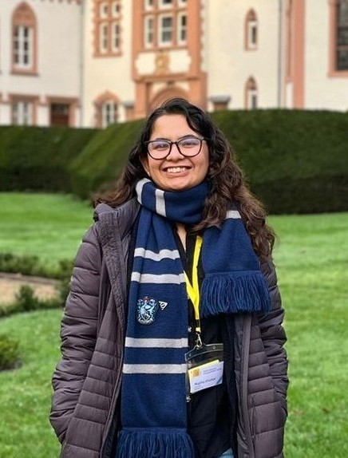

---
# Feel free to add content and custom Front Matter to this file.
# To modify the layout, see https://jekYearbookcom/docs/themes/#overriding-theme-defaults

layout: archive
author_profile: false

announcements:
  scrollable: true   # enable vertical scrolling
  limit: 5           # number of items to display before scrolling

---
{:refdef: style="text-align: center;"}
{:width="250"}
{:refdef}

Hi! I am Mugdha Khedkar <small>(pronunciation: <a href="#" onclick="document.getElementById('nameAudio').play(); return false;" title="Play pronunciation">🔊</a>).</small><audio id="nameAudio"><source src="{{ '/assets/audio/mugdha-khedkar.mp3' | relative_url }}" type="audio/mpeg"></audio> I am a Research Associate at [Heinz Nixdorf Institut](https://www.hni.uni-paderborn.de/) at Paderborn University, Germany. I recently completed my PhD under the supervision of [Prof. Dr. Eric Bodden](https://www.bodden.de/) in the [Secure Software Engineering group](https://www.hni.uni-paderborn.de/sse/). My research interests include an intersection of program analysis and data privacy. My work explores the role of static program analysis in ensuring protection and privacy of user data in Android apps. 

**Latest News**
=====

<ul class="dated-rows news-rows">
<li>Sep 2026

I [successfully defended](https://www.hni.uni-paderborn.de/en/message/wir-gratulieren-mugdha-khedkar-zu-ihrer-bestandenen-promotionspruefung) my Doctoral Dissertation at Paderborn University 🎓🎉. NEW

{: .announcement-photo}
{: .announcement-photo}

</li>
<li>Jul 2026

I'm serving on the Artifact Evaluation Committee of [ASE 2026](https://conf.researchr.org/home/ase-2026). NEW

</li>
<li>May 2026

I submitted my Doctoral Dissertation titled <em>Assisting GDPR Compliance through Static Analysis of Android Apps</em> at Paderborn University 📝💻🎉. NEW

</li>
<li>May 2026

I have been invited to serve as a Program Committee member for [ICSE 2027](https://conf.researchr.org/track/icse-2027/icse-2027-src) (ACM Student Research Competition).

</li>
<li>Apr 2026

I presented our research paper at [MOBILESoft 2026](https://conf.researchr.org/home/mobilesoft-2026) in Rio De Janeiro (Brazil), and attended [ICSE 2026](https://conf.researchr.org/home/icse-2026) 🇧🇷.

</li>
<li>Apr 2026

I have been invited to serve as a Program Committee member for [ASE 2026](https://conf.researchr.org/track/ase-2026/ase-2026-tools-and-data-sets) (Tools and Datasets).

</li>
<li>Mar 2026

I have been invited to serve as a Program Committee member for [QUATIC 2026](https://2026.quatic.org/) (Thematic Track Security and Privacy).

</li>
<li>Mar 2026

I attended [SANER 2026](https://conf.researchr.org/home/saner-2026) in Limassol (Cyprus), where I presented our tool demonstration paper 🇨🇾.

</li>
<li>Feb 2026

I gave a talk at Max Planck Institute for Security and Privacy (🇩🇪).

</li>
<li>Feb 2026

Our paper has been accepted for publication in the [Automated Software Engineering Journal](https://link.springer.com/journal/10515) 🎉🎊.

</li>
<li>Jan 2026

Our paper has been accepted at [MOBILESoft 2026](https://conf.researchr.org/home/mobilesoft-2026) 🎉🎊.

</li>
<li>Dec 2025

A couple of things happened:

- Our paper has been accepted for publication in the [Automated Software Engineering Journal](https://link.springer.com/journal/10515) 🎉🎊.
- Our tool paper has been accepted at [SANER 2026](https://conf.researchr.org/track/saner-2026/saner-2026-tool-demo-track) 🎉🎊!
- I'm serving on the Artifact Evaluation Committee of [USENIX 2026](https://www.usenix.org/conference/usenixsecurity26) and [PoPETS 2026](https://petsymposium.org/).
- I visited Davis Security Lab, University of California Davis and gave an invited talk (🇺🇸).
- I gave a virtual talk at King's College London (🇬🇧).

</li>
<li>Oct 2025

I organized a [workshop session](https://www.linkedin.com/posts/mugdha-khedkar-1410a3102_knowledgenet-epn-activity-7390034778466627584-uWFY?utm_source=share&utm_medium=member_desktop&rcm=ACoAABn_XwEBdAM1kUZsRPrHxDcgJq1cRHI2o7k) at the IAPP European Privacy KnowledgeNet 2025 at Munich (🇩🇪).

</li>
<li>Oct 2025

I gave a talk at LMU Munich (🇩🇪) and TU Wien (🇦🇹).

</li>
<li>Sep 2025

I gave a talk at Hasso Plattner Institute, University of Potsdam (🇩🇪).

</li>
<li>Sep 2025

I have been invited to serve as a Program Committee member for [STATIC 2026](https://conf.researchr.org/home/icse-2026/static-2026).

</li>
<li>Aug 2025

I gave a talk at IT University, Copenhagen (🇩🇰).

</li>
<li>Jul 2025

I attended the 4th Summer School on Security Testing & Verification ([ST&V 2025](https://cybersecurity-research.be/summer-school-on-security-testing-and-verification-2025)) in Brussels, and presented a [poster](/assets/MugdhaSVT2025Poster.pdf) 🇧🇪.

</li>
<li>May 2025

I have been invited to serve as a Program Committee member for [ASE 2025](https://conf.researchr.org/home/ase-2025) (Tool Demonstrations).

</li>
<li>Mar 2025

I gave a talk at Amazon, Santa Clara (🇺🇸).

</li>
<li>Nov 2024

I attended [ASE 2024](https://conf.researchr.org/home/ase-2024) in Sacramento (California), where I presented our papers at the A-Mobile workshop 🇺🇸.

</li>
<li>Oct 2024

I gave a [talk](https://engineering.ucdavis.edu/events/cs-talk-static-analysis-android-gdpr-compliance-assurance) at University of California, Davis (🇺🇸).

</li>
<li>Oct 2024

I gave a talk at the [CyberResilience.NRW kickoff event](https://www.linkedin.com/feed/update/urn:li:activity:7249410975156563969/) in Paderborn.

</li>
<li>Sep 2024

I got selected to be a student volunteer for [ASE 2024](https://conf.researchr.org/home/ase-2024).

</li>
<li>Sep 2024

Two papers were accepted at the [7th International Workshop on Advances in Mobile App Analysis](https://a-mobile.github.io/amobile2024.html) held in conjunction with [ASE 2024](https://conf.researchr.org/home/ase-2024) 🎉🎊.

</li>
<li>Jul 2024

I became a member of the [Data Privacy Vocabularies and Controls Community Group](https://www.w3.org/community/dpvcg/).

</li>
<li>Apr 2024

I have been invited to serve as a Program Committee member for [ASE 2024](https://conf.researchr.org/home/ase-2024) (Tool Demonstrations).

</li>
<li>Apr 2024

I presented our short paper at [MOBILESoft 2024](https://conf.researchr.org/home/mobilesoft-2024) and attended [ICSE 2024](https://conf.researchr.org/home/icse-2024) in Lisbon, Portugal 🇵🇹.

</li>
<li>Mar 2024

Our short paper was accepted at [MOBILESoft 2024](https://conf.researchr.org/home/mobilesoft-2024) Research Forum 🎉🎊.

</li>
<li>Oct 2023

I participated in the [Dagstuhl Research Methods Seminar 2023](https://www.dagstuhl.de/en/seminars/seminar-calendar/seminar-details/23433) 🇩🇪. I have shared my experience [here](https://mugdhak30.github.io/Schloss-Dagstuhl/).

</li>
<li>May 2023

I gave a talk titled "Security and Privacy by Design" at Get to Know HNI 2023, Universität Paderborn.

</li>
<li>May 2023

I presented a poster at the [ICSE 2023 Doctoral Symposium](https://conf.researchr.org/track/icse-2023/icse-2023-DS) in Melbourne, Australia 🇦🇺.

</li>
<li>Mar 2023

My short paper was accepted at [ICSE 2023 Doctoral Symposium](https://conf.researchr.org/track/icse-2023/icse-2023-DS) 🎉🎊.

</li>
<li>Dec 2022

I was selected as a Junior PC member for the research track of [MSR 2023](https://conf.researchr.org/track/msr-2023/msr-2023-technical-papers?).

</li>
</ul>

